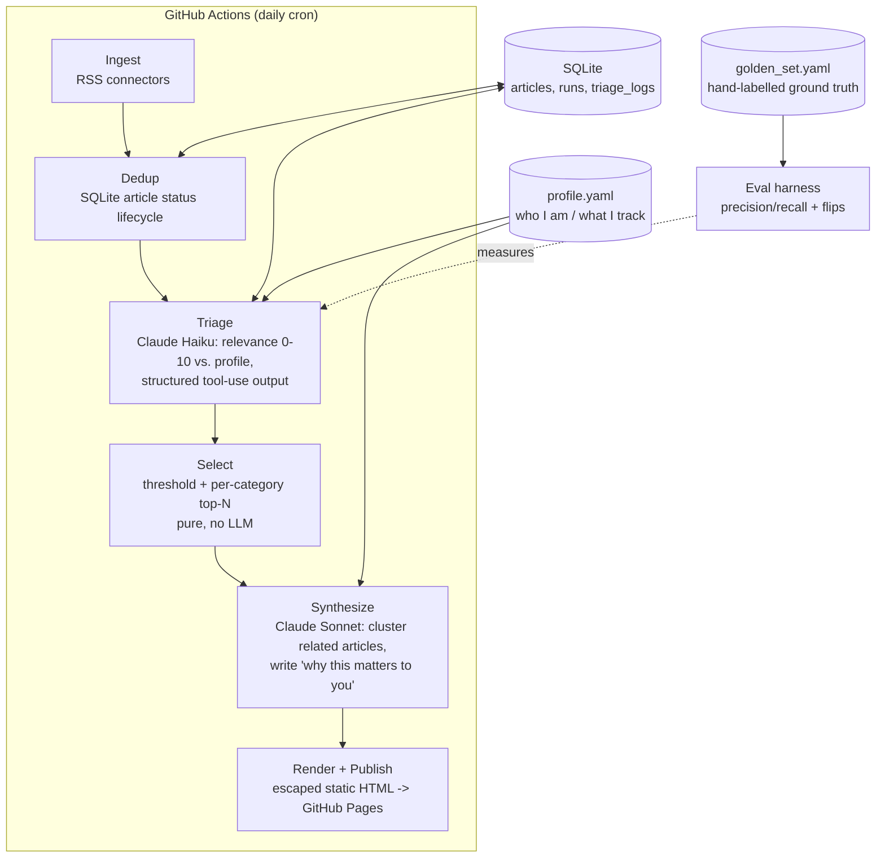

# Daily AI Assistant — Architecture

A personal, autonomous news agent that monitors **software engineering and applied-AI news
relevant to an AI Application Engineer**, filters and synthesizes it against a personal
profile, and publishes a daily digest to GitHub Pages.

This is deliberately *not* an RSS aggregator with an LLM bolted on. The design goals:

1. **Personal** — every relevance decision is grounded in a structured profile of who I am,
   what stage I'm at, and what would change my next move ("does this change what I should
   learn or build next?", not "is this about AI?").
2. **Measured** — relevance quality is evaluated against a hand-labelled golden set, not
   asserted. Cost is recorded per run, not assumed.
3. **Synthesized** — multiple sources covering the same event become one story with an
   explicit *"why this matters to you"* line.
4. **A learning vehicle** — each phase intentionally exercises a core AI Application
   Engineer skill (structured outputs, evals, observability, autonomous operation,
   RAG/memory, agent orchestration).

> **Scope note (2026-09).** The project originally also tracked South Australian skilled
> migration news. That half was retired after evaluation showed the feeds carried
> essentially none of the intended signal — see `tickets/TICKET-031`. The machinery is
> topic-agnostic; the scope narrowed, the design did not.

## System overview



## Components

| Module | Responsibility | Key tech |
|---|---|---|
| `source.py` | Fetch and parse feeds into normalized `Article` objects | `feedparser` |
| `pipeline.py` | `ingest`: fetch all sources, drop already-seen via status lifecycle | — |
| `triage.py` | Score each new article 0–10 against the profile; category + reason | Claude Haiku, tool-use |
| `selection.py` | Threshold filter + per-category top-N. Pure function, no LLM | — |
| `synthesize.py` | Cluster survivors into digest entries with "why it matters" | Claude Sonnet, tool-use |
| `render.py` | `DigestItem[]` → escaped, styled HTML. Pure function | `html.escape` |
| `run.py` | Composition root; `main()` does the I/O and writes `docs/` | — |
| `protocol.py` | `LLMClient` Protocol + `LLMResponse` — the provider seam | `typing.Protocol` |
| `adapters.py` | `AnthropicLLMClient` — adapts the SDK to `LLMClient` | — |
| `telemetry.py` | `TrackedClient` decorator; per-model token and cost accounting | — |
| `factory.py` | `build_client()` — the one place a provider is named | — |
| `storage.py` | SQLite: article lifecycle, run telemetry, triage log | `sqlite3` stdlib |
| `eval/` | Golden set, sanity fixtures, labeler, precision/recall report | custom harness |

### The profile (what makes it personal)

`profile.yaml` is structured state, versioned in git (nothing secret), edited manually:

```yaml
identity:
  location: Adelaide, South Australia
  role: AI Engineer (ServiceNow / LLM applications)
  career_goal: AI Application Engineer

topics:
  engineering:
    interests:
      - LLM application patterns (agents, RAG, structured outputs, evals)
      - Claude API / model releases across major providers
      - Python, Go, TypeScript ecosystem news relevant to backend + AI work
    irrelevant:
      - consumer gadget news, funding rounds without technical substance
```

Topic names are **data, not code** — `category_options()` derives the triage category enum
from `topics` keys, so adding or removing a topic requires no code change. The triage and
synthesis prompts receive the profile verbatim. Personalization quality lives here and in
the prompts, which is exactly what the eval harness measures.

### Sources

Every feed is pre-flight tested before being added — it must parse, return entries, and
carry real summary text rather than an echoed headline (`TICKET-031`).

| Source | Role | Measured yield |
|---|---|---|
| MarkTechPost | LLM/AI application news | 7/7 wanted in the golden set |
| InfoQ | Backend, languages, architecture | 6/13 wanted |
| Hacker News (150+ points) | Community-filtered AI/eng signal | added after pre-flight test |
| InnovationAus | Australian tech industry | **on trial** — review after two weeks |

Connectors are deliberately pluggable: adding a source is a `source.yaml` entry.

## Data model (SQLite)

```sql
articles(url PRIMARY KEY, status, updated_at, first_seen_at)

runs(id, started_at, finished_at, articles_fetched, articles_scored, articles_relevant,
     articles_digested, total_input_tokens, total_output_tokens, estimated_cost_usd,
     status, error_message)

triage_logs(id, url, source, title, summary, relevance, category, reason, created_at)
```

`articles` is a **state** table — one row per URL, overwritten as it moves through the
lifecycle. `triage_logs` is an **event log** — append-only, one row per triage decision,
never rewritten. Keeping those separate is deliberate; conflating them invites the upsert
bugs recorded in `TICKET-011`.

Digest content is **not** in SQLite. Each day's digest is rendered to a dated HTML file in
`docs/` and committed, with a JSON sidecar so same-day re-runs accumulate rather than
overwrite. Git is the archive.

## LLM strategy

- **Two-tier model use:** Haiku for high-volume/cheap triage of every new article;
  Sonnet only for the low-volume/high-value synthesis step.
- **Structured outputs everywhere:** both calls use forced tool-use with a JSON Schema,
  validated into Pydantic models (`TriageResult`, `DigestItem`). No free-text parsing.
- **Provider seam:** `triage.py` and `synthesize.py` depend only on the `LLMClient`
  Protocol. Swapping providers is a change in `factory.py` and one new adapter.
- **Cost envelope:** measured, not assumed — around a cent or two per daily run in steady
  state, ~$0.12 for a 50-article evaluation run. Verified against the Anthropic console.

## Evaluation

- `eval/golden_set.yaml` — 50 hand-labelled articles. Labelled **blind**: the model's own
  score was hidden until after each judgement, so labels don't anchor on it.
- `eval/sanity_fixtures.yaml` — a mechanical plumbing check. Proves the harness runs; it
  does **not** prove triage is correct.
- `eval/report.py` — offline mode scores the frozen snapshot; `--live` re-runs triage and
  reports **classification flips** plus precision/recall, appending to `history.jsonl`
  with a profile hash, model id and cost.

Two measurement facts worth remembering (`TICKET-034`): triage is ~98% reproducible run to
run, but with only 15 gold-positive articles a single flip moves F1 by 0.04. **Read flip
counts, not metric deltas.**

## Roadmap — each phase maps to an AI App Engineer skill

| Phase | Deliverable | Skill it builds |
|---|---|---|
| **0. Scaffold** ✅ | Python 3.12 + `uv`, project layout, config, tests | Modern Python tooling |
| **1. Ingestion + memory v0** ✅ | Connectors, normalization, SQLite dedup, no LLM | Data plumbing |
| **2. Triage + digest + automation** ✅ | Triage & synthesis, telemetry, static-site delivery, daily cron | Prompt engineering, structured outputs, cost tiering, autonomous operation |
| **3. Eval harness** ✅ | Golden set, precision/recall + flip report, noise floor measured | LLM evaluation — the highest-leverage differentiator |
| **4. Local model comparison** | `OpenAIAdapter`; vLLM on an RTX 4090 behind the `LLMClient` seam; benchmark against Haiku on the golden set | Model serving, provider abstraction, evidence-based model choice |
| **5. Semantic memory** | Embeddings for cross-source near-duplicate merge and story continuity | RAG / embeddings, when the limitation is actually felt |
| **6. Agentic upgrade** | Hand-rolled tool-use loop — including source discovery: propose a feed, fetch it, triage a sample, keep it if the hit rate clears a bar | Agent orchestration from scratch |

Design rule: **hand-roll the orchestration in v1** (understandable, interviewable),
consider a LangGraph refactor only after the agent loop exists, as a comparison exercise.

## Decisions log

| Decision | Choice | Why |
|---|---|---|
| Language | Python | AI-ecosystem fit; converts "academic Python" into applied Python |
| LLM provider | Claude API | Structured outputs + prompt caching fit; seam allows swapping |
| Orchestration | Hand-rolled pipeline → agent loop | Learn the mechanics before adopting a framework |
| Memory v1 | SQLite only | Dedup + history don't need embeddings; add vectors when gaps appear |
| Hosting | GitHub Actions cron | Zero infra, free, secrets built in; no always-on server for a daily job |
| Delivery | Static site on GitHub Pages | Shareable link beats an inbox for a portfolio artifact; no SMTP credentials |
| Digest history | Committed HTML snapshots | Git is already a versioned store; no `digest_items` table needed yet |
| Provider seam | `Protocol` + adapter, telemetry outside | Adapter normalizes provider shape; the decorator then works for any provider (`TICKET-024`) |
| Migration tracking | Retired 2026-09 | Evaluation showed the corpus carried none of the intended signal (`TICKET-031`) |
