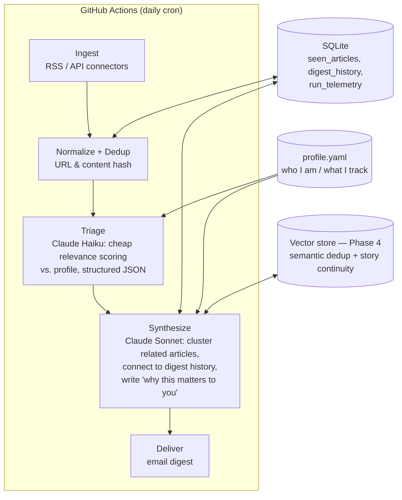

# Daily AI Assistant — Architecture

A personal, autonomous news agent that monitors **South Australian / Australian skilled
migration news** and **software engineering news relevant to an AI Application Engineer**,
filters and synthesizes it against a personal profile, and delivers a daily digest.

This is deliberately *not* an RSS aggregator with an LLM bolted on. The design goals:

1. **Personal** — every relevance decision is grounded in a structured profile of who I am,
   what stage I'm at, and what would change my next move (e.g. "190/491 invitation rounds
   for ICT occupations in SA", not "immigration news").
2. **Continuous** — the agent remembers what it has already told me and connects new
   stories to previous ones ("follow-up to Tuesday's processing-delay story") instead of
   re-summarizing from scratch.
3. **Synthesized** — multiple sources covering the same event become one story with an
   explicit *"why this matters to you"* line.
4. **A learning vehicle** — each phase intentionally exercises a core AI Application
   Engineer skill (structured outputs, agent orchestration, RAG/memory, evals,
   observability, autonomous operation).

## System overview



## Components

| Component | Responsibility | Key tech |
|---|---|---|
| `sources/` | One connector per source; each yields normalized `Article` objects | `feedparser`, `httpx` |
| `pipeline/ingest` | Fetch all sources, normalize, hash, drop already-seen | — |
| `pipeline/triage` | Score each new article 0–10 for relevance against the profile; category + one-line reason | Claude Haiku, structured outputs |
| `pipeline/synthesize` | Cluster related survivors, pull related past digest entries, write the digest with continuity + "why it matters" | Claude Sonnet |
| `pipeline/deliver` | Render digest (Markdown → HTML) and send email | SMTP or Resend |
| `storage/` | SQLite schema + repository functions | `sqlite3` stdlib |
| `profile.yaml` | Structured personal profile (see below) | — |
| `telemetry/` | Tokens, cost, latency per LLM call; per-run summary logged and stored | structured JSON logging |
| `evals/` | Golden set of labeled articles; measures triage precision/recall as prompts evolve | `pytest` + custom harness |

### The profile (what makes it personal)

`profile.yaml` is structured state, versioned in git (nothing secret), edited manually in v1:

```yaml
identity:
  location: Adelaide, South Australia
  role: AI Engineer (ServiceNow / LLM applications)
  career_goal: AI Application Engineer

immigration:
  pathway: AU skilled migration
  watching:
    - SA state nomination (190/491) invitation rounds and criteria changes
    - ICT occupation list changes
    - Department of Home Affairs policy / processing-time announcements
  irrelevant:
    - other states' nomination news unless it signals national policy shifts
    - family/partner/humanitarian visa streams

engineering:
  interests:
    - LLM application patterns (agents, RAG, structured outputs, evals)
    - Claude API / model releases across major providers
    - Python, Go, TypeScript ecosystem news relevant to backend + AI work
  irrelevant:
    - consumer gadget news, funding rounds without technical substance
```

The triage and synthesis prompts receive this profile verbatim. Personalization quality
lives here and in the prompts — which is exactly what the eval harness (Phase 3) measures.

### Sources (initial list, to be validated in Phase 1)

**Immigration (AU/SA):**
- migration.sa.gov.au — SA state nomination announcements
- Department of Home Affairs / immi.gov.au news
- Selected migration-agent blogs and newsletters that report invitation rounds quickly

**Software engineering / AI:**
- Hacker News (front page via Algolia API, filtered)
- Anthropic / OpenAI / Google AI blogs
- InfoQ, dev.to (AI + backend tags)

Connectors are deliberately pluggable: adding a source is one small module.

## Data model (SQLite)

```sql
seen_articles(id, url, url_hash, content_hash, source, title, published_at, first_seen_at)
digest_items(id, run_id, article_ids, story_key, headline, summary, relevance_score,
             why_it_matters, category, created_at)
runs(id, started_at, finished_at, articles_fetched, articles_new, articles_relevant,
     total_input_tokens, total_output_tokens, est_cost_usd, status, error)
```

`story_key` groups digest items that belong to the same evolving story across days —
the hook that story continuity (and later semantic retrieval) attaches to.

## LLM strategy

- **Two-tier model use:** Haiku for high-volume/cheap triage of every new article;
  Sonnet only for the low-volume/high-value synthesis step. This is the standard
  cost-tiering pattern in production LLM systems and worth learning early.
- **Structured outputs everywhere:** triage returns strict JSON
  (`{relevance: int, category: str, reason: str, story_hint: str}`) validated with
  Pydantic. No free-text parsing.
- **Prompt caching:** the profile + instructions form a stable prefix cached across the
  run's triage calls.
- **Cost envelope:** ~50–100 new articles/day through Haiku triage + one Sonnet
  synthesis call ≈ **a few cents per day**. Telemetry verifies this rather than assumes it.

## Roadmap — each phase maps to an AI App Engineer skill

| Phase | Deliverable | Skill it builds |
|---|---|---|
| **0. Scaffold** | Python 3.12 + `uv`, project layout, config, CI lint/test | Modern Python tooling |
| **1. Ingestion + memory v0** | Connectors, normalization, SQLite dedup — runs end-to-end with *no LLM* | Data plumbing (where most real AI-app work lives) |
| **2. Triage + digest + automation** | Claude triage & synthesis, email delivery, GitHub Actions cron, telemetry | Prompt engineering, structured outputs, cost tiering, autonomous operation |
| **3. Eval harness** | Golden set (~50 labeled articles), precision/recall report, prompt iteration loop | LLM evaluation — the highest-leverage differentiator |
| **4. Semantic memory** | Embeddings + vector store; semantic dedup (same story, different words); story continuity retrieval | RAG / embeddings, done when the limitation is actually felt |
| **5. Agentic upgrade** | Hand-rolled tool-use loop: agent decides to fetch full article text / search for corroboration when triage is uncertain | Agent orchestration from scratch (no framework hiding the loop) |
| **6. Feedback loop** *(later)* | Thumbs up/down capture → profile adaptation | Online personalization |

Design rule: **hand-roll the orchestration in v1** (understandable, interviewable),
consider a LangGraph refactor only after Phase 5, as a comparison exercise.

## Decisions log

| Decision | Choice | Why |
|---|---|---|
| Standalone vs. inside TheAppBackend | Standalone | Clean learning arc; separate resume artifact (Python/agents/evals vs. Go/GCP) |
| Language | Python | AI-ecosystem fit; converts "academic Python" into applied Python |
| LLM provider | Claude API | Breadth vs. existing Gemini experience; structured outputs + prompt caching fit |
| Orchestration | Hand-rolled pipeline → agent loop | Learn the mechanics before adopting a framework |
| Memory v1 | SQLite only | Dedup + history don't need embeddings; add vectors when semantic gaps appear |
| Hosting | GitHub Actions cron | Zero infra, free, secrets built in; no always-on server needed for a daily job |
| Feedback loop | Deferred to Phase 6 | Capture mechanism is real engineering; profile-as-file covers v1 |
