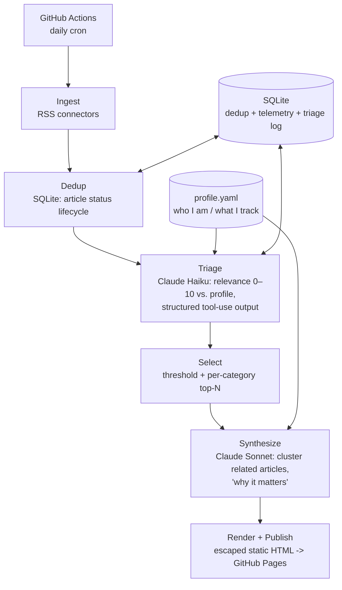

# Daily AI Assistant

A personal, autonomous news agent that monitors **software-engineering and applied-AI news
relevant to an AI Application Engineer**, filters it against a personal profile using
Claude, and publishes a daily digest — live at
**[matoship.github.io/Daily_AI_Assistant](https://matoship.github.io/Daily_AI_Assistant/)**.

The goal is deliberately *not* an RSS aggregator with an LLM bolted on. Every relevance
decision is grounded in a structured profile of who I am and what I'm working toward — and
that judgement is **measured against hand-labelled ground truth**, not asserted.

## How it works



Two-tier model use — cheap **Haiku** to triage every article, expensive **Sonnet** only for
the low-volume synthesis step — keeps the daily cost to a couple of cents, measured (not
assumed) via per-model token and cost telemetry stored with every run. Claude returns
**structured output** at every step, validated with Pydantic, so scores and digest entries
are type-checked rather than parsed out of prose.

Both LLM calls go through an `LLMClient` **Protocol**, so the provider is named in exactly
one place — which is what makes swapping in a locally-served model a one-line change.

## Measuring whether it actually works

Anyone can call an LLM API. The harder question is whether the output is any good, so this
project answers it with evidence:

- **50 hand-labelled articles**, labelled *blind* — the model's own score stayed hidden
  until after each judgement, so the labels don't anchor on it.
- **`uv run daily-assistant-report`** scores triage against those labels: precision,
  recall and F1, broken down by category and by whether the input was even judgeable.
- **`--live` re-runs triage** with the current prompt and reports **classification flips**
  — which specific articles changed verdict — appending each run to `history.jsonl` with a
  profile hash, model id and cost.

Two things that measurement produced, which intuition would have missed:

- A profile edit that *felt* like an improvement dropped F1 from 0.75 to 0.59. Caught
  before it shipped.
- Half the daily corpus turned out to carry essentially none of the signal it was added
  for — no prompt change could have fixed it, and every health check looked green the whole
  time ([`TICKET-031`](tickets/TICKET-031-immigration-corpus-contains-no-signal.md)).

The [postmortem log](tickets/README.md) documents 34 real incidents — a silently missed
cron firing, truncated responses dropping articles for weeks, an XSS gap caught before it
shipped, and a fix that recreated the flaw it was written about.

Full design and rationale: [`ARCHITECTURE.md`](ARCHITECTURE.md).

## Tech stack

Python 3.12 · [`uv`](https://github.com/astral-sh/uv) · Claude API (Anthropic) ·
Pydantic / pydantic-settings · SQLite · feedparser · pytest · mypy · ruff ·
GitHub Actions (daily cron) · GitHub Pages (static delivery)

## Status

Built in phases; each maps to a core AI-engineering skill. See the
[roadmap](ARCHITECTURE.md#roadmap--each-phase-maps-to-an-ai-app-engineer-skill).

- [x] **Phase 0** — project scaffold, config, tests
- [x] **Phase 1** — ingestion + SQLite dedup ("memory")
- [x] **Phase 2** — triage + synthesis, cost telemetry, static-site delivery, daily automation
- [x] **Phase 3** — eval harness: labelled golden set, precision/recall + flip report, noise floor measured
- [ ] **Phase 4** *(next)* — local model via vLLM behind the `LLMClient` seam, benchmarked against Haiku on the golden set
- [ ] Phase 5 — semantic memory (embeddings) for near-duplicate merge and story continuity
- [ ] Phase 6 — hand-rolled agent loop, including automated source discovery

## Layout

```
src/daily_assistant/
  models.py       # Article, TriageResult, DigestItem, Source, GoldLabel (Pydantic)
  source.py       # RSS connectors -> Article
  storage.py      # SQLite: article lifecycle, run telemetry, triage log
  pipeline.py     # ingest: fetch -> dedup -> new articles
  triage.py       # Haiku: article + profile -> TriageResult
  selection.py    # threshold + per-category top-N (pure)
  synthesize.py   # Sonnet: cluster selected articles -> DigestItem[]
  render.py       # DigestItem[] -> escaped HTML, light/dark (pure)
  run.py          # composition root; main() writes docs/ and publishes
  protocol.py     # LLMClient Protocol + LLMResponse — the provider seam
  adapters.py     # AnthropicLLMClient — adapts the SDK to the Protocol
  telemetry.py    # TrackedClient decorator: per-model token + cost accounting
  factory.py      # build_client() — the only place a provider is named
  profile.py      # load profile / sources from YAML
  config.py       # settings from .env (never hardcode the API key)
  profile.yaml    # personal interest profile — topics are data, not code
  source.yaml     # curated sources, each with a justification
  eval/           # golden set, sanity fixtures, blind labeler, precision/recall report
tests/            # pytest — LLM and network dependencies mocked
tickets/          # postmortem log: symptom -> root cause -> fix -> lesson
.github/workflows/daily-digest.yaml
```

## Running

```bash
uv sync
echo "ANTHROPIC_API_KEY=sk-ant-..." > .env    # not committed

uv run pytest                  # fast, fully mocked, no API cost
uv run ruff check
uv run mypy src/

uv run daily-assistant         # full pipeline -> docs/
uv run daily-assistant-sanity  # plumbing check against live triage (~1c)
uv run daily-assistant-report  # score triage against the golden set (offline: free)
```

In production this runs once a day via
[`.github/workflows/daily-digest.yaml`](.github/workflows/daily-digest.yaml), committing its
own output (`seen.db`, `docs/`) back to the repo — no external database or hosting, just git
and GitHub Pages.
