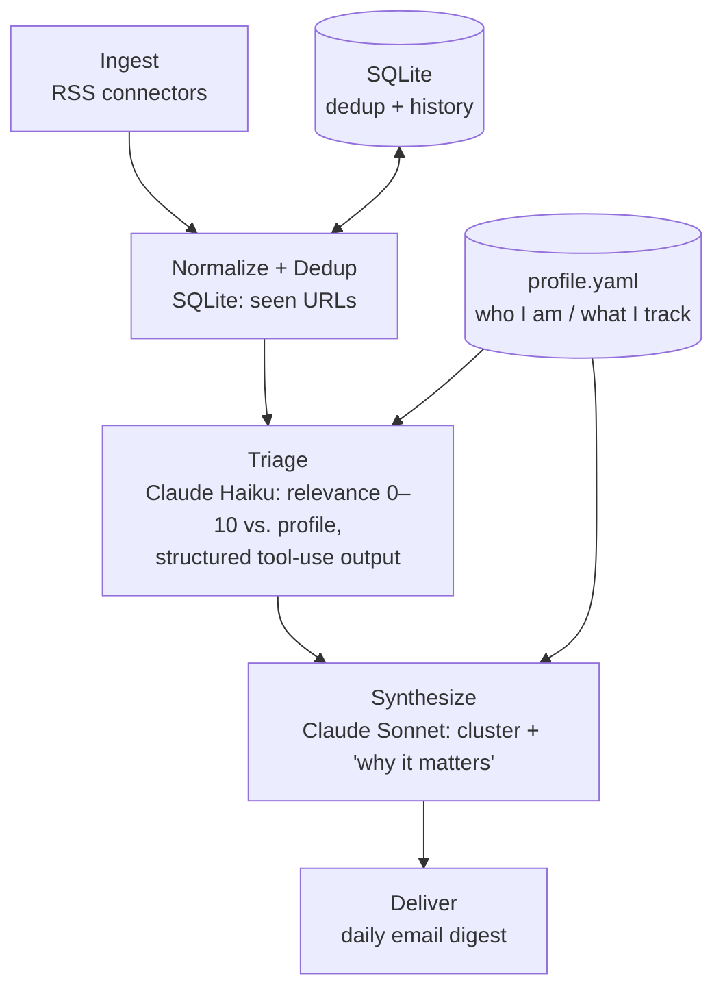

# Daily AI Assistant

A personal, autonomous news agent that monitors **South Australian / Australian skilled
migration news** and **software-engineering news relevant to an AI Application Engineer**,
filters it against a personal profile using Claude, and (eventually) delivers a daily digest.

The goal is deliberately *not* an RSS aggregator with an LLM bolted on. Every relevance
decision is grounded in a structured profile of who I am and what I'm tracking — so the
agent says *"this is a follow-up to Tuesday's SA nomination round, and here's why it matters
to your ICT pathway"*, not *"here are 20 headlines."*

## How it works



Two-tier model use — cheap **Haiku** to triage every article, expensive **Sonnet** only for
the low-volume synthesis step — keeps the daily cost to a few cents. Claude returns
**structured output** (validated with Pydantic), so relevance scores and categories are
type-checked, not parsed out of free text.

Full design and rationale: [`ARCHITECTURE.md`](ARCHITECTURE.md).

## Tech stack

Python 3.12 · [`uv`](https://github.com/astral-sh/uv) · Claude API (Anthropic) ·
Pydantic / pydantic-settings · SQLite · feedparser · pytest · ruff ·
GitHub Actions (scheduled runs, planned)

## Status

Built in phases; each phase maps to a core AI-App-Engineer skill (data plumbing → structured
outputs → evals → RAG → agent loop). See [`ARCHITECTURE.md`](ARCHITECTURE.md#roadmap--each-phase-maps-to-an-ai-app-engineer-skill).

- [x] **Phase 0** — project scaffold, config, tests
- [x] **Phase 1** — ingestion + SQLite dedup ("memory")
- [x] **Phase 2 (core)** — Claude triage with profile-grounded, validated structured output
- [ ] Phase 2 (rest) — synthesis, email delivery, scheduled automation + cost telemetry
- [ ] Phase 3 — evaluation harness (labeled golden set, precision/recall)
- [ ] Phase 4 — semantic memory (embeddings) for story continuity
- [ ] Phase 5 — hand-rolled agent loop

## Layout

```
src/daily_assistant/
  models.py      # Article, TriageResult, Source (Pydantic)
  source.py      # RSS connectors -> Article
  storage.py     # SQLite dedup store (context-managed)
  pipeline.py    # ingest: fetch -> dedup -> new articles
  triage.py      # Claude call: article + profile -> TriageResult
  profile.py     # load profile / sources from YAML
  config.py      # settings from .env (never hardcode the API key)
  profile.yaml   # personal interest profile
tests/           # pytest, LLM/network dependencies mocked
```

## Running

```bash
uv sync
echo "ANTHROPIC_API_KEY=sk-ant-..." > .env    # not committed
uv run pytest
uv run ruff check
```
