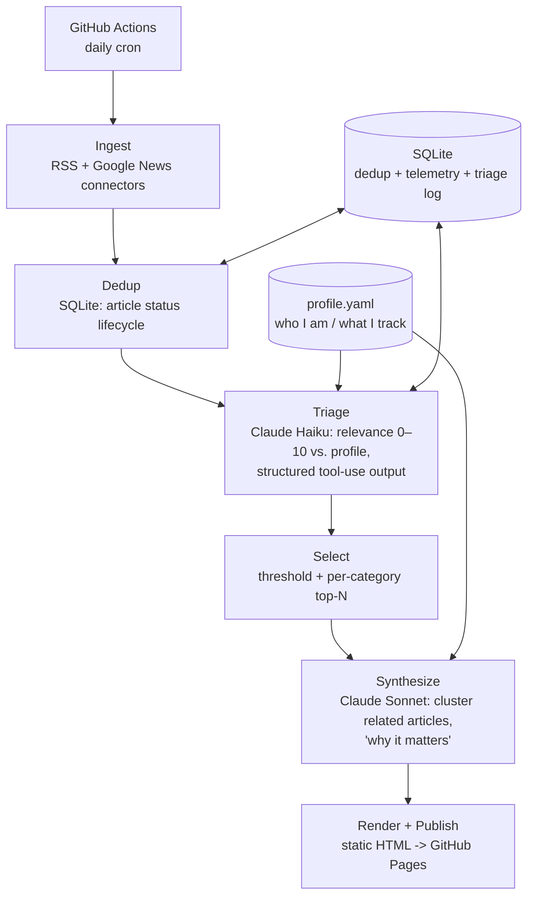

# Daily AI Assistant

A personal, autonomous news agent that monitors **South Australian / Australian skilled
migration news** and **software-engineering news relevant to an AI Application Engineer**,
filters it against a personal profile using Claude, and delivers a daily digest —
published live at **[matoship.github.io/Daily_AI_Assistant](https://matoship.github.io/Daily_AI_Assistant/)**.

The goal is deliberately *not* an RSS aggregator with an LLM bolted on. Every relevance
decision is grounded in a structured profile of who I am and what I'm tracking — so the
agent says *"this is a follow-up to Tuesday's SA nomination round, and here's why it matters
to your ICT pathway"*, not *"here are 20 headlines."*

## How it works



Two-tier model use — cheap **Haiku** to triage every article, expensive **Sonnet** only for
the low-volume synthesis step — keeps the daily cost to a few cents, measured (not assumed)
via per-run token/cost telemetry stored alongside every run. Claude returns **structured
output** (validated with Pydantic) at every step, so relevance scores, categories, and
digest entries are type-checked, not parsed out of free text.

Runs unattended once a day via GitHub Actions, publishing straight to GitHub Pages —
[the postmortem log](tickets/README.md) documents real incidents hit along the way (a
missed cron firing, a same-day overwrite bug, an XSS gap in the renderer caught before it
ever shipped, and others).

Full design and rationale: [`ARCHITECTURE.md`](ARCHITECTURE.md).

## Tech stack

Python 3.12 · [`uv`](https://github.com/astral-sh/uv) · Claude API (Anthropic) ·
Pydantic / pydantic-settings · SQLite · feedparser · pytest · ruff ·
GitHub Actions (daily cron) · GitHub Pages (static delivery)

## Status

Built in phases; each phase maps to a core AI-App-Engineer skill (data plumbing → structured
outputs → evals → RAG → agent loop). See [`ARCHITECTURE.md`](ARCHITECTURE.md#roadmap--each-phase-maps-to-an-ai-app-engineer-skill).

- [x] **Phase 0** — project scaffold, config, tests
- [x] **Phase 1** — ingestion + SQLite dedup ("memory")
- [x] **Phase 2** — Claude triage + synthesis, cost telemetry, static-site delivery, daily automation via GitHub Actions
- [ ] **Phase 3** *(in progress)* — evaluation harness: real triage judgments now logged to build a labeled golden set from; precision/recall metric next
- [ ] Phase 4 — semantic memory (embeddings) for story continuity
- [ ] Phase 5 — hand-rolled agent loop

## Layout

```
src/daily_assistant/
  models.py       # Article, TriageResult, DigestItem, Source, ArticleStatus (Pydantic)
  source.py       # RSS/Google News connectors -> Article
  storage.py      # SQLite: article lifecycle, run telemetry, triage log (context-managed)
  pipeline.py     # ingest: fetch -> dedup -> new articles
  triage.py       # Claude Haiku call: article + profile -> TriageResult
  selection.py    # threshold + per-category top-N selection for synthesis
  synthesize.py   # Claude Sonnet call: cluster selected articles -> DigestItem[]
  telemetry.py    # transparent client wrapper: per-model token/cost tracking
  render.py       # DigestItem[] -> HTML (escaped, styled, light/dark)
  run.py          # pipeline orchestration + main() entry point (writes docs/, publishes)
  profile.py      # load profile / sources from YAML
  config.py       # settings from .env (never hardcode the API key)
  profile.yaml    # personal interest profile
  source.yaml     # curated RSS/Google News sources, with justifications
tests/            # pytest, LLM/network dependencies mocked
tickets/          # postmortem log — real bugs found while building this
.github/workflows/daily-digest.yaml  # daily cron: run pipeline, commit, publish
```

## Running

```bash
uv sync
echo "ANTHROPIC_API_KEY=sk-ant-..." > .env    # not committed
uv run pytest
uv run ruff check
uv run daily-assistant   # full pipeline: ingest -> triage -> synthesize -> publish to docs/
```

In production this runs once a day via [`.github/workflows/daily-digest.yaml`](.github/workflows/daily-digest.yaml),
committing its own output (`seen.db`, `docs/`) back to the repo — no external database or
hosting, just git and GitHub Pages.
